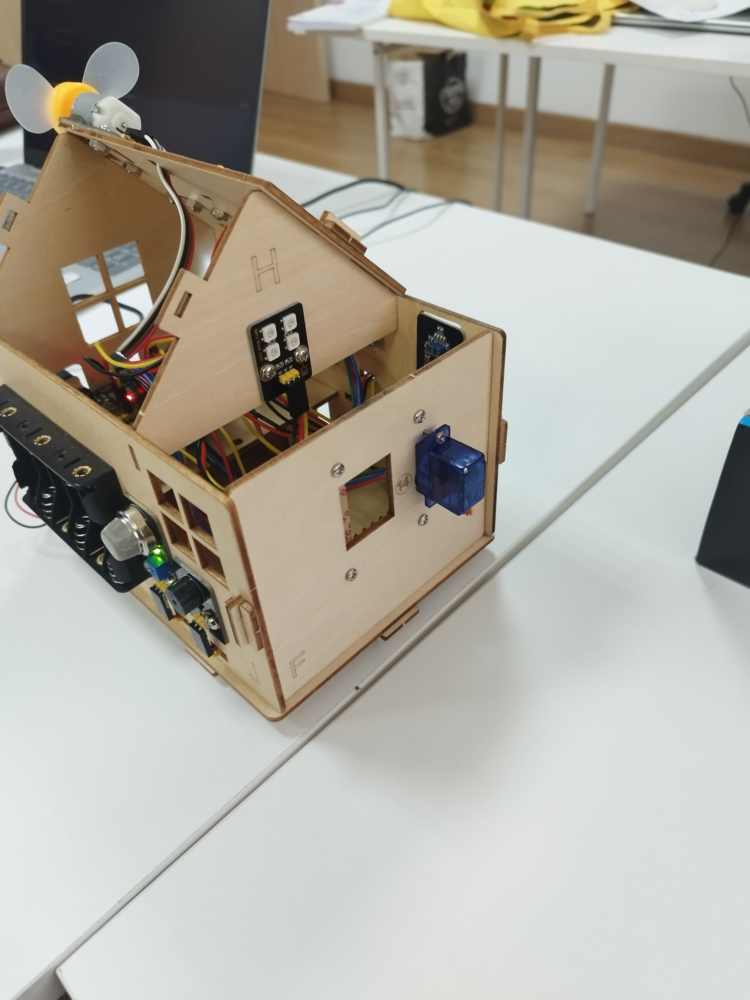
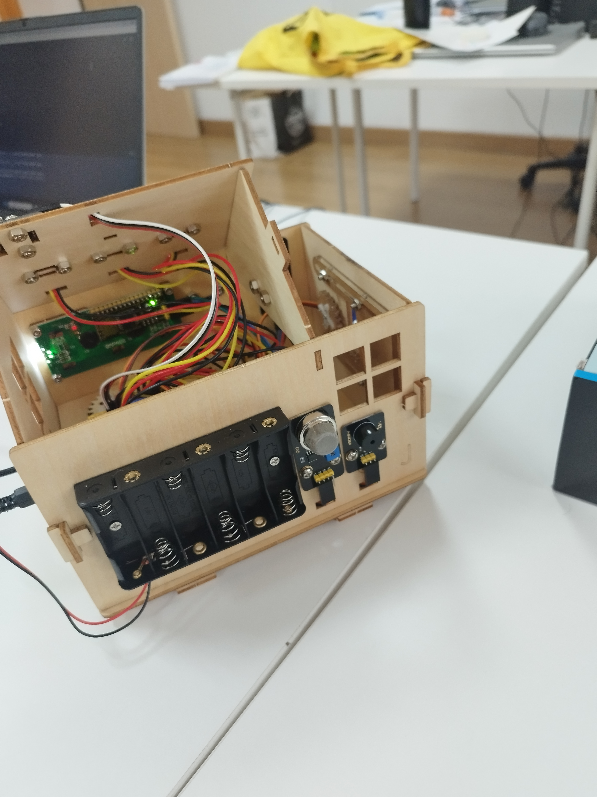

# Keyestudio Smart Home Kit with PLUS Board for Arduino DIY STE

## Read Me First

1. Please download all the files needed to run the robot arm, including the driver,
   codes, libraries, etc: https://fs.keyestudio.com/FKS0003
2. Technical Support: service@keyestudio.com
3. What do you need to prepare:

* Six AA batteries or two 18650 batteries
* A computer with a stable Internet connection
* We can use the joystick to control the robot arm. But if you want to
  control it wirelessly, you need to prepare a 2.4 GHz WiFi(It can be a
  mobile hotspot or a router)
